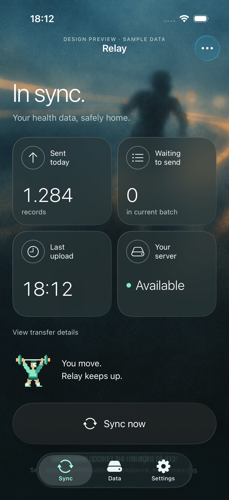
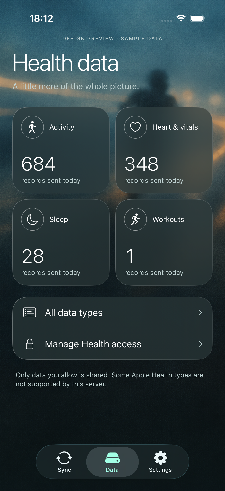
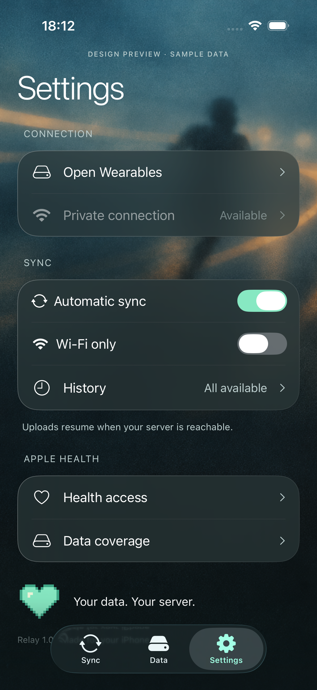

<p align="center">
  
</p>

<h1 align="center">Relay</h1>

<p align="center"><strong>Your health data. Your server.</strong></p>

<p align="center">Apple Health → Open Wearables<br>Native SwiftUI · iOS 26+ · Liquid Glass · Pixel art</p>

<p align="center">
  <a href="#get-started">Get started</a> ·
  <a href="docs/COVERAGE.md">Health data coverage</a> ·
  <a href="docs/OPEN-WEARABLES-AGENT-HANDOFF.example.md">Connect an AI agent</a>
</p>

Relay sends the Apple Health records you choose to your own Open Wearables server. Explore your history, ask your agents questions about it, and build your own workflows around the data.

A smoky teal interface pairs native Liquid Glass controls with a mint pixel heart and athletes that cycle through gym, running, cycling and tennis.

## A look inside

<table>
  <tr>
    <th>Sync</th>
    <th>Health data</th>
    <th>Settings</th>
  </tr>
  <tr>
    <td></td>
    <td></td>
    <td></td>
  </tr>
</table>

*Actual iPhone Simulator screenshots. Every screen above uses demo mode and synthetic data; no personal health records or connection details are shown.*

## What Relay does

| Feature | How it works |
| --- | --- |
| Your server | Pair with your own HTTPS Open Wearables instance using a one-time invitation code. |
| Your choice | Read only the Apple Health categories you allow. Relay never writes to Apple Health. |
| Resumable history | Import available history in small batches, then pick up new records with anchored queries. |
| Automatic updates | Sync while open and during background opportunities scheduled by iOS. |
| Connection recovery | Keep pending batches on the iPhone and retry when the server is reachable. |
| Native interface | SwiftUI, Liquid Glass navigation, system controls, accessibility text sizes and Reduce Motion support. |
| Agent access | Connect a separate agent to the server through the official MCP adapter. |

## Get started

You need **iOS 26+**, **Xcode 26+**, a reachable **Open Wearables server** and an Apple signing team that supports the app's HealthKit entitlements. The reviewed server contract is Open Wearables **0.9.0**. The source includes the generated Xcode project and has no external runtime packages.

1. Open `Relay.xcodeproj` in Xcode 26 or newer (built here with Xcode 27).
2. Select the **Relay** target → **Signing & Capabilities** → choose your Apple development team. The HealthKit and background delivery entitlements are included. You need a signing team/provisioning profile that supports them.
3. Connect and unlock your iPhone running iOS 26 or newer. Enable Developer Mode when Xcode requests it. Select it as the run destination and Run.
4. Make sure your iPhone can reach your Open Wearables server over HTTPS. Enter your own server address when connecting; Relay ships without a configured server.
5. In Open Wearables, open **Users**, select your user and generate a one-time invitation code. Tap **Connect your server** in Relay and enter that code. Pairing redeems the code for user-scoped tokens; administrator keys and app secrets never go into the app.
6. Choose Health access. Keep Relay open for the first historical import. Afterwards, HealthKit observer events and system-scheduled background tasks provide automatic opportunities to sync.

For a private local signing override, create the git-ignored `Config/Local.xcconfig` with the following settings. Keep your bundle identifier stable for updates so that existing app data and Keychain credentials remain accessible. Never put tokens or invitation codes there.

```xcconfig
DEVELOPMENT_TEAM = YOUR_TEAM_ID
RELAY_BUNDLE_IDENTIFIER = com.yourdomain.relay
```

## What syncs

- 71 reviewed HealthKit quantity types, plus sleep stages and workouts (73 types on the tested runtime).
- All visible history, with no date cutoff, read in bounded pages of 200 changes per type.
- Incremental anchored queries, stable sample IDs, source information, timestamps, canonical units, metadata and workout events.
- Durable, protected pending batches. A failed upload or failed local checkpoint write keeps the batch and its old anchor for retry.
- One-time invitation pairing, Keychain token storage, refresh-token rotation and a single retry after an expired access token.
- Automatic or manual sync, Wi-Fi-only transport restrictions, offline recovery and resumable history import.
- After granting additional Health access, **Settings → History → Rescan all history** includes previously inaccessible older records. The app preserves an unsent batch before allowing a rescan.

**This is not a complete Apple Health archive.** The installed Open Wearables ingestion contract lacks some HealthKit mappings and deletion support. Nutrition, reproductive health, mindfulness, symptoms, medication records, clinical records, ECG waveforms, audiograms, workout routes/series and some measurements are not uploaded. See [the exact coverage and unit decisions](docs/COVERAGE.md). Deleted sample IDs are retained locally, but corresponding server records are not removed.

An HTTP 202 receipt means the server queued the upload. Relay’s **sent** counters describe acceptance, not database ingestion or unique records. Check the server’s **Syncs** page for processing outcomes. Server normalization may discard metadata that was present in the upload.

Apple does not reveal denied read permissions. Empty results can mean no data or no access. iOS schedules background delivery; there is no permanently running service or guaranteed interval. Locked health data, system restrictions, force-quitting the app, and network reachability can delay uploads. Reopen Relay after force-quit.

## Development

There are no external runtime packages. XcodeGen is only needed when changing the project definition; the generated Xcode project is included.

```sh
xcodegen generate
xcodebuild -project Relay.xcodeproj -scheme Relay \
  -destination 'platform=iOS Simulator,name=iPhone 17 Pro' \
  -parallel-testing-enabled NO test
```

Add `--demo` to the Xcode scheme’s launch arguments to view the approved design with explicit sample data. This mode does not pair, read HealthKit, save settings, or upload. Remove it for the actual app. The normal launch starts unpaired without fabricated statistics.

The decorative artwork beside “You move. Relay keeps up.” cycles through gym, running, cycling, and tennis, with four seconds per sport. It pauses offscreen or while inactive and shows a still pixel heart when **Reduce Motion** is enabled. The Settings footer also uses the heart. The background and icon are generated artwork; the athlete animations are drawn in code.

- `Relay/Core`: server validation, Keychain, HTTP client and protected checkpoint store.
- `Relay/Health`: reviewed catalog, HealthKit queries and payload mapping.
- `Relay/Sync`: background scheduling and persisted upload/checkpoint lifecycle.
- `Relay/UI`: native tabs, design components, setup and status screens.
- `RelayTests`, `RelayUITests`: transfer, security, unit conversion and navigation tests.
- [Validation evidence](docs/VALIDATION.md).
- [Generic MCP agent setup](docs/OPEN-WEARABLES-AGENT-HANDOFF.example.md).

The catalog was checked against the live server OpenAPI and Open Wearables 0.9.0 source. The official SDK was inspected; its default type set is narrower and its public status callbacks do not provide the receipt/state control needed here. Relay uses a small direct client for the same API. Its workout-name vocabulary is adapted under the SDK’s MIT license; see [third-party notices](docs/THIRD-PARTY-NOTICES.md).

## Physical-device verification still required

After installation, pair your own account, grant a small initial selection, and sync. Verify the actual sample IDs/values in the server after processing. Then allow the remaining supported categories, rescan history and validate background wakeups, locked-device recovery, Wi-Fi-only behavior and network reconnects. A successful simulator test is not evidence of these device behaviors.

## References

- [Open Wearables native SDK documentation](https://openwearables.io/docs/sdk/ios)
- [Open Wearables invitation-token flow](https://openwearables.io/docs/sdk)
- [Apple HealthKit observer queries](https://developer.apple.com/documentation/healthkit/executing-observer-queries)
- [Apple Liquid Glass](https://developer.apple.com/documentation/swiftui/applying-liquid-glass-to-custom-views)
